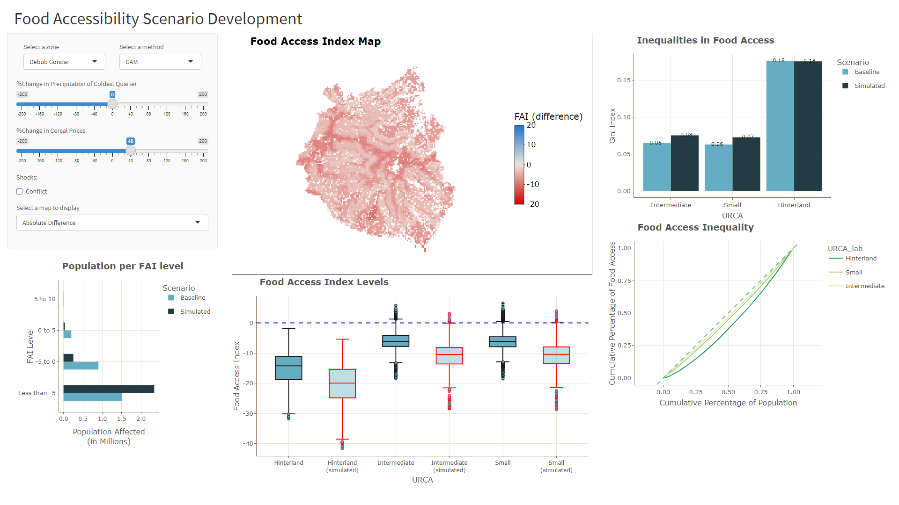

# **Food Accessibility Index for Ethiopia**

### This repository contains all the R scripts used in the development of the food accessibility index (FAI) for Ethiopia as part of my MSc thesis. It also contains all maps and plots created from the scripts.
---
## **A. Food Access Index Development**
#### Each script has its own purpose and requirements and should be run in this sequence of steps to reproduce the results in the MSc thesis:

1. [Preprocessing of LSMS survey data](https://github.com/enzocampomanesv/food-access-msc-thesis/blob/main/scripts/Food_access_index/ETH_ESS_variable_preproc.R)
2. [Food access index construction using PCA](https://github.com/enzocampomanesv/food-access-msc-thesis/blob/main/scripts/Food_access_index/ETH_LSMS_PCA.R)
3. [Cereal price prediction](https://github.com/enzocampomanesv/food-access-msc-thesis/blob/main/scripts/Cereal_price/ETH_WFP_PricePrediction_v3.R)
4. [Population-weighted averaging](https://github.com/enzocampomanesv/food-access-msc-thesis/blob/main/scripts/Food_access_index/ETH_geoAveraging_1km.R) - run after spatially joining the geospatial input with the grids for averaging.
5. [Variable selection with RF](https://github.com/enzocampomanesv/food-access-msc-thesis/blob/main/scripts/Food_access_index/ETH_RF_varsel.R)
6. [GAM training and FAI prediction](https://github.com/enzocampomanesv/food-access-msc-thesis/blob/main/scripts/Food_access_index/ETH_GAM.R)
7. [Food access inequality quantification](https://github.com/enzocampomanesv/food-access-msc-thesis/blob/main/scripts/Food_access_index/ETH_Ineq.R)
---
### The following images are some of the major results from the MSc thesis:

- Map of calculated FAI at each LSMS geolocation
&nbsp;

&nbsp;
- Map of extrapolated annual average FAI for Ethiopia 

&nbsp;
- Maps of monthly differences of the food access index from the annual average.

---
## **B. Scenario building for food accessibility**
---
#### A R Shiny dashboard application was developed for food access scenario building. The app allows users to simulate shocks to the system like conflict, increased cereal prices, and increased precipitation during the coldest quarter. The app then predicts the food access index on-the-fly based on such shocks and the different plots on food access and food access inequality per URCA are also updated. Below is a screenshot of the dashboard which is also [available online](https://enzocampomanes.shinyapps.io/fai_combined/).
---
